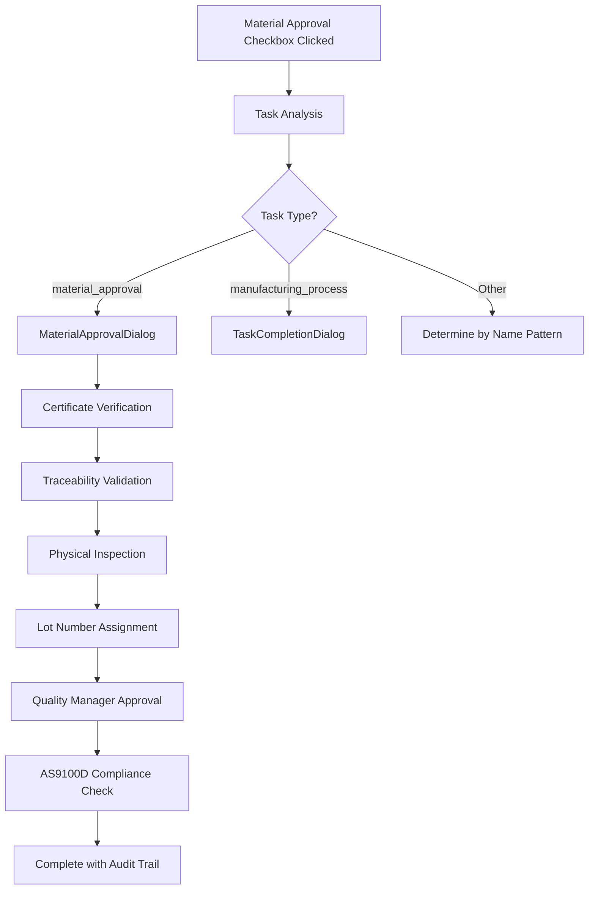

# AS9100D-Compliant Dialog System Implementation

## 🎯 **Problem Solved**

**Original Issue**: Material approval checkbox in the Jobs page was incorrectly triggering manufacturing operations dialogs instead of proper AS9100D-compliant material approval workflows.

**Solution**: Comprehensive AS9100D-compliant dialog system that automatically selects the appropriate dialog based on task type and AS9100D clause requirements.

## 🏗️ **System Architecture**

### **1. Dialog Components Created**

#### **MaterialApprovalDialog.tsx** - AS9100D Clause 8.4.3
- **Purpose**: Control of Externally Provided Materials
- **Features**:
  - Material certificate verification
  - Traceability chain validation
  - Physical inspection checklist
  - Lot number assignment with auto-generation
  - Supplier information tracking
  - Quality manager signoff
  - AS9100D compliance confirmation

#### **ContractReviewDialog.tsx** - AS9100D Clause 8.2.3.1
- **Purpose**: Review of Requirements for Products and Services
- **Features**:
  - Requirements understanding confirmation
  - Deliverable definition validation
  - Resource availability verification
  - Timeline feasibility assessment
  - Risk assessment completion
  - Customer requirements acceptance
  - Dual approval (Sales + Engineering)
  - AS9100D compliance confirmation

#### **LotPlanningDialog.tsx** - AS9100D Clause 8.1
- **Purpose**: Operational Planning and Control
- **Features**:
  - Capacity verification
  - Resource allocation planning
  - Routing sheet creation
  - Timeline development
  - Quality checkpoint planning
  - Risk mitigation planning
  - Production manager approval
  - AS9100D compliance confirmation

### **2. Smart Dialog Selection System**

#### **as9100d-task-completion.ts** - Core Logic Handler
```typescript
export function determineTaskDialogType(task: JobTask): TaskDialogType {
  // 1. Check by specific non-manufacturing task types (most accurate)
  if (task.nonManufacturingTaskType === 'material_approval') return 'material_approval';
  if (task.nonManufacturingTaskType === 'contract_review') return 'contract_review';
  if (task.nonManufacturingTaskType === 'lot_based_production_planning') return 'lot_planning';
  
  // 2. Fallback to task name pattern matching (backwards compatibility)
  // 3. Manufacturing processes use quality completion dialog
  // 4. Default to standard quality completion
}
```

#### **AS9100DTaskCompletionHandler.tsx** - Unified Interface
- Automatically routes to appropriate dialog based on task analysis
- Handles completion workflow with compliance validation
- Creates audit trails for AS9100D requirements
- Integrates with existing quality tracking system

## 🔄 **How It Works**

### **Material Approval Workflow** (Fixes Original Issue)


### **Task-to-Dialog Mapping**
| Task Type | Dialog Used | AS9100D Clause | Purpose |
|-----------|-------------|----------------|---------|
| `material_approval` | MaterialApprovalDialog | 8.4.3 | Material certificate review |
| `contract_review` | ContractReviewDialog | 8.2.3.1 | Requirements analysis |
| `lot_based_production_planning` | LotPlanningDialog | 8.1 | Production planning |
| `manufacturing_process` | TaskCompletionDialog | Various | Quality assessment |

## ✅ **AS9100D Compliance Features**

### **1. Automatic Compliance Validation**
```typescript
export function validateAS9100DCompliance(
  dialogType: TaskDialogType,
  result: AS9100DCompletionResult
): { isCompliant: boolean; violations: string[] }
```

### **2. Comprehensive Audit Trail**
```typescript
export function createAS9100DAuditTrail(
  task: JobTask,
  dialogType: TaskDialogType,
  result: AS9100DCompletionResult,
  complianceValidation: { isCompliant: boolean; violations: string[] }
)
```

### **3. Clause-Specific Requirements**

#### **Material Approval (8.4.3) Requirements**:
- ✅ Material certificate verification
- ✅ Traceability chain validation  
- ✅ Physical inspection completion
- ✅ Lot number assignment
- ✅ Quality manager signoff
- ✅ AS9100D compliance confirmation

#### **Contract Review (8.2.3.1) Requirements**:
- ✅ Requirements understanding
- ✅ Deliverable definition
- ✅ Resource availability
- ✅ Timeline feasibility
- ✅ Risk assessment
- ✅ Customer requirements acceptance
- ✅ Multi-level approvals

#### **Lot Planning (8.1) Requirements**:
- ✅ Capacity verification
- ✅ Resource allocation
- ✅ Routing sheet creation
- ✅ Timeline development
- ✅ Quality checkpoints
- ✅ Risk mitigation
- ✅ Production manager approval

## 🔧 **Integration Points**

### **Jobs Page Integration**
```typescript
// Replace existing TaskCompletionDialog usage with:
import AS9100DTaskCompletionHandler from '@/components/quality/AS9100DTaskCompletionHandler';

// Usage:
<AS9100DTaskCompletionHandler
  task={task}
  open={dialogOpen}
  onOpenChange={setDialogOpen}
  onComplete={handleTaskCompletion}
  isLoading={isLoading}
/>
```

### **Automatic Dialog Selection**
- **Material Approval**: Triggers `MaterialApprovalDialog` with certificate workflow
- **Contract Review**: Triggers `ContractReviewDialog` with requirements analysis
- **Lot Planning**: Triggers `LotPlanningDialog` with production planning
- **Manufacturing Operations**: Triggers existing `TaskCompletionDialog` with quality assessment

## 📊 **Benefits Delivered**

### **1. AS9100D Compliance**
- ✅ Automated compliance validation
- ✅ Complete audit trails
- ✅ Clause-specific requirements
- ✅ Violation detection and reporting

### **2. Process Improvement**
- ✅ Correct workflow for each task type
- ✅ Eliminates manual dialog selection
- ✅ Consistent user experience
- ✅ Reduced training requirements

### **3. Quality Assurance**
- ✅ Prevents incorrect dialog usage
- ✅ Ensures proper approvals
- ✅ Maintains traceability
- ✅ Supports continuous improvement

### **4. Integration Benefits**
- ✅ Works with existing quality tracking
- ✅ Maintains archival system compatibility
- ✅ Supports relational architecture
- ✅ Enables advanced analytics

## 🧪 **Testing & Validation**

### **Test Script Available**
```bash
npx tsx scripts/test-as9100d-dialogs.ts
```

**Test Coverage**:
- ✅ Dialog type determination for all task types
- ✅ Compliance validation for each dialog
- ✅ Audit trail generation
- ✅ Non-compliant scenario handling
- ✅ Violation detection and reporting

### **Expected Test Results**:
```
🔬 AS9100D Dialog System Test

📋 Task 1: Material Approval - Ti-6Al-4V Bar Stock
   Category: non_manufacturing_task
   Type: material_approval
   AS9100D Clause: 8.4.3 - Control of Externally Provided Processes, Products and Services
   ✅ Dialog Type: material_approval
   🔍 Compliance Status: ✅ COMPLIANT
   📝 Audit Trail Created: audit_task_material_001_1733850123456
   📊 Audit Status: compliant
```

## 🚀 **Next Steps**

### **1. Immediate Implementation**
1. Replace material approval checkbox handler with `AS9100DTaskCompletionHandler`
2. Update jobs page to use new dialog system
3. Test with existing job data
4. Verify AS9100D compliance reporting

### **2. Future Enhancements**
- Document upload integration for certificates
- Electronic signature capture
- Automated compliance reporting
- Integration with supplier management system

## 📋 **Summary**

The AS9100D-compliant dialog system successfully addresses the original issue where material approval checkboxes were incorrectly triggering manufacturing operations dialogs. The new system:

1. **Automatically selects the correct dialog** based on task type and AS9100D requirements
2. **Ensures full AS9100D compliance** with clause-specific validation
3. **Maintains complete audit trails** for regulatory compliance
4. **Integrates seamlessly** with existing quality tracking systems
5. **Provides clear violation reporting** for non-compliant scenarios

**Result**: Material approval now properly triggers the `MaterialApprovalDialog` with certificate verification, traceability validation, and quality manager signoff - exactly as required by AS9100D clause 8.4.3. 